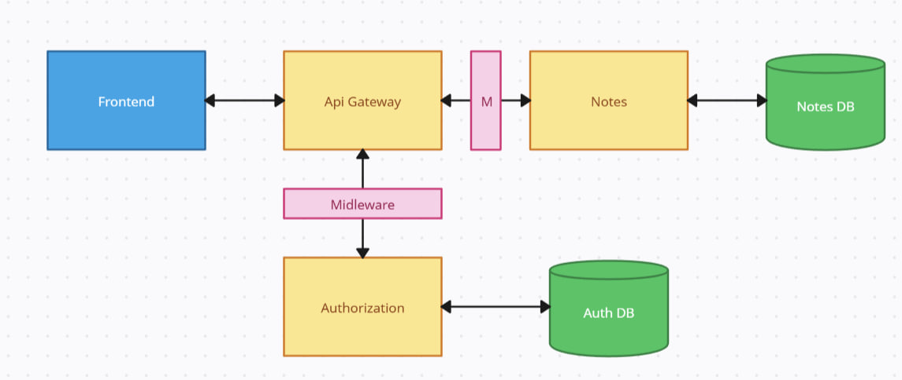
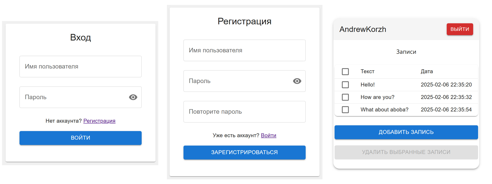

# my-notes

## Идея:
Небольшое веб приложение с микросервисной архитектурой для хранения записей различных пользователей.

Бэк - `Python` + `FastAPI`, фронт - `React`

## Схема

## Интерфейс
Ну, как-то так это выглядит... В целом, нормальный внешний вид не был целью... 

Базовые настройки портов (временно): `api - 5000`, `auth - 8000`, `notes - 8080`, `front - 3000`

npm install - для фронта
# TODO
- Добавить user_id (скрытый от пользователя)  и к нему уже имя привязывать
- Переписать ответы midleware + всё на англ
- Много дублирующегося кода, например в api_gateway - вынести в одну функцию
- Описать api методы для api_gateway
- на фронте все запросы в отдельную функцию обернуть
- придумать как быть с сылками при работе локально/ в локальной сети/в инете (baseURL - ужас, избыиться, может env или что-то такое)
- token -> acsesstoken or smth
- Добавить проверку на фронте активен ли токен
- Запуск всё одной командой
- Щапуск через docker-compose
- ApiGateway - как регистратор
- Разнести по файликам разным (особенно home: {hone, dialog, requests})
- Поработать над адаптивностью
- Сделать нормальное развёртывание локально и поработать над env
- Переделать иконки стоковые реакта
- requirements